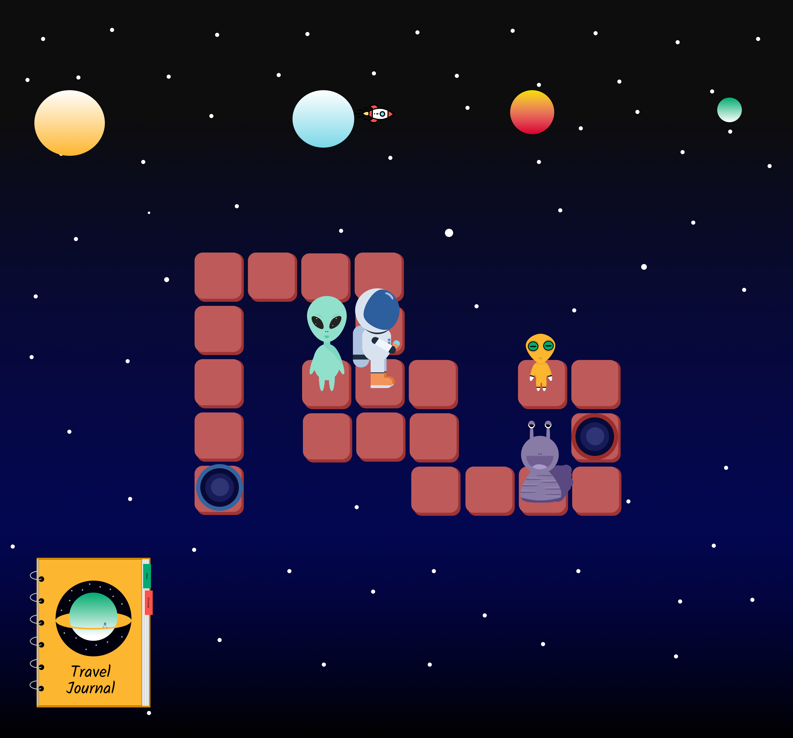

[![Contributors][contributors-shield]][contributors-url]
[![Commits][commits-shield]][commits-url]
[![Forks][forks-shield]][forks-url]
[![Stargazers][stars-shield]][stars-url]
[![Issues][issues-shield]][issues-url]

<!-- PROJECT LOGO -->
 

  

  <h3 align="center">Judy Adventures</h3>

  

    A game where an astronaut explores other planets and learn more about the space.
     
    <a href="https://github.com/DaniloLira/WWDC-2021"><strong>Explore documentation</strong></a>
     
     
    <a href="https://github.com/DaniloLira/WWDC-2021">TestFlight</a>
    ·
    <a href="https://github.com/DaniloLira/WWDC-2021">Report Bug</a>
  

<!-- TABLE OF CONTENTS -->
## Table of contents

* [About the project](#about-the-project)
* [Tecnologias utilizadas](#tecnologias-utilizadas)
* [Gitflow](#git-flow)

<!-- ABOUT THE PROJECT -->
## About the project
In Judy's adventure you need to help him to reach his rocket and come back home, but the aliens will not allow you to pass until you answer their questions. The aliens are friendly and just want to ensure that Judy really learned something from his time on the space.
 
 - The astronaut has a travel journal where he writes everything he knows about the aliens and his discoveries from the space.
 - You just can talk to an alien when you are close to him, so walk to the aliens.
 - To reach another planet Judy needs to go through the portals.
 
Learn about the space and help Judy to go home!

| Canvas | Question | Notebook |
|----------|----------|----------|
|   |    |    |

### Technologies used
Here i list the technologies used to build this project
* [Swift](https://swift.org/)
* [SpriteKit](https://developer.apple.com/spritekit/)

<!-- MARKDOWN LINKS & IMAGES -->
<!-- https://www.markdownguide.org/basic-syntax/#reference-style-links -->
[contributors-shield]: https://img.shields.io/github/contributors/DaniloLira/WWDC-2021.svg?style=flat-square
[contributors-url]: https://img.shields.io/github/contributors/DaniloLira/WWDC-2021
[forks-shield]: https://img.shields.io/github/forks/DaniloLira/WWDC-2021.svg?style=flat-square
[forks-url]: https://img.shields.io/github/forks/DaniloLira/WWDC-2021
[commits-shield]: https://img.shields.io/github/last-commit/DaniloLira/WWDC-2021.svg?style=flat-square
[commits-url]: https://img.shields.io/github/last-commit/DaniloLira/WWDC-2021
[stars-shield]: https://img.shields.io/github/stars/DaniloLira/WWDC-2021.svg?style=flat-square
[stars-url]: https://img.shields.io/github/stars/DaniloLira/WWDC-2021
[issues-shield]: https://img.shields.io/github/issues/DaniloLira/WWDC-2021.svg?style=flat-square
[issues-url]: https://img.shields.io/github/issues/DaniloLira/WWDC-2021
[product-screenshot]: images/screenshot.png
